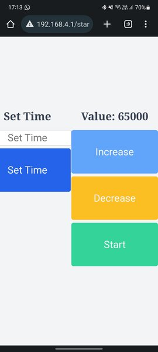

# Shot Counter for Tokyo Marui M3 Super 90

This project uses a Raspberry Pi Pico to count shots fired from an M3 Super 90 airsoft gun by Tokyo Marui. It uses two LEDs (one red and one green) to visually display the count and a button to start the count.

## Features

- **Shot Counting**: The system keeps track of the number of shots fired and displays the count via the LEDs.
- **Web Interface**: The device can be controlled via a simple web interface, which allows you to increase, decrease the value, set a time, and start the system.
- **Setting Saving**: Settings such as brightness value and time can be saved and loaded between sessions.

## Circuit Diagram

- **Red LED**: Connected to pin 5.
- **Green LED**: Connected to pin 13.
- **Button (Endstop)**: Connected to pin 0, configured with pull-up.

## How to Use

1. **Load the Code**: Load the `main.py`, `leds.py`, `settings.py`, and `web_page.py` files onto the Raspberry Pi Pico.
2. **Configure the Network**: Modify the `ssid` and `password` variables in `main.py` to set the name and password for the Wi-Fi hotspot.
3. **Start the System**: Press the button to start counting shots.
4. **Web Interface**: Connect to the IP address displayed on the console to access the web interface and control the system.

# Marui M3 super 90 counter

Hello everyone, this is a little project to upgrade your Marui M3 super 90 shotgun!

I created this project because it's very difficoult to count shots when you play airsoft with a shotgun.
This shotgun fires 3 rounds at a time, and with 30 bbs per shell you have only 10 shots.
So I thought to fix this problem with a raspberry pi pico w, a 3D printer, and a little code.

It's very easy to use, just some little soldering and time, and you will be able to play better with your shotgun!

Starting the counter (pushing batteries) the rp pico will start an hot-spot connection called 'RPI_PICO_AP' *.
On your phone, tablet or PC connect to the network with this password: '12345678'. (You can change network name and password in the main.py file).
Now open your browser and go to 192.168.4.1. A web page appear.

Here you can set time to choose if you want that leds turn down after some time (usefull for night game!) and the leds brightness.

The brightness start from 0 (no light) to 65000 (max power), and touching "increase" and "decrease" leds will change the brightness.

After choose your settings you can touch "start" and leds turn off.
Your setting will be saved in a file called settings.txt

After that you cannot change settings, you have to reload the device pull and push battery again.

*You have only 60 seconds to go inside the web page. Instead device will upload saved settings.
